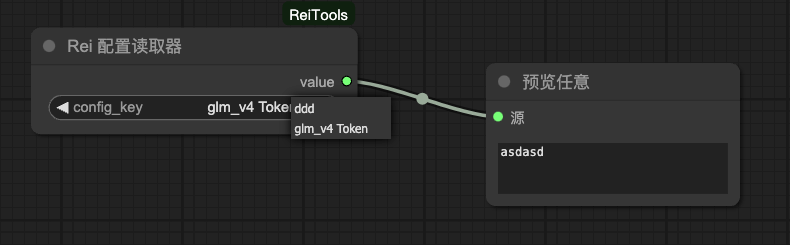
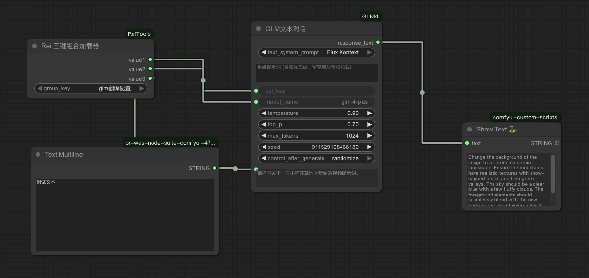
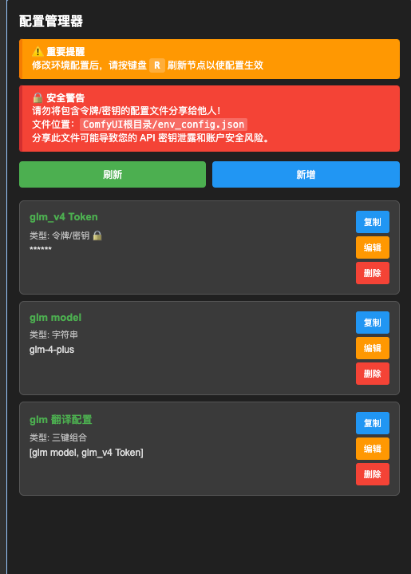
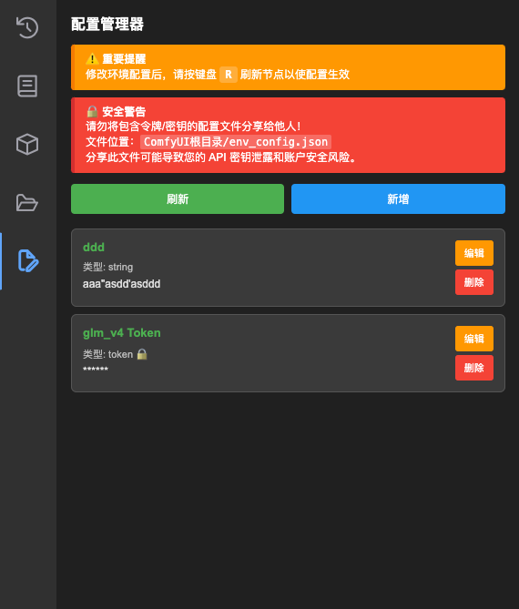

# ComfyUI-ReiTools

这是一个为 [ComfyUI](https://github.com/comfyanonymous/ComfyUI) 设计的自定义节点合集，包含一些方便工作流搭建的实用工具。

## 🆕 最近更新

### v1.3.0 (最新) - 🔐 加密存储与安全增强

- ✨ **新增 Token 加密存储功能**：支持使用密码对敏感配置进行对称加密
- 🔑 **配置读取器密码支持**：读取加密配置时可输入密码自动解密
- 🎯 **智能权限控制**：加密配置需要正确密码才能编辑、复制和读取
- 💾 **配置存储升级**：从简单键值对升级为包含类型、加密状态、时间戳的对象格式
- 🛡️ **安全体验优化**：就近错误提示、自动滚动、密码错误拦截等
- 🔧 **Bug 修复**：修复类型显示错误、3KeyGroup 下拉列表等问题

### v1.2.0 - 📋 用户体验优化

- 📋 **一键复制功能**：为每个配置项添加复制到剪贴板按钮
- 🎛️ **编辑体验改进**：编辑时禁用键名和类型修改，增加自动滚动
- ⚡ **实时验证增强**：改进输入验证和错误提示机制
- 🎨 **界面优化**：更好的视觉反馈和用户引导

### v1.1.0 - 🔗 三键组合功能

- 🔗 **三键组合类型**：支持将最多三个配置键组合管理
- 📦 **批量加载节点**：`Rei3KeyGroupLoader` 节点一次性获取三个配置值
- 🎯 **智能选择器**：配置管理器中的键选择下拉框，支持重复检查

### v1.0.0 - 🚀 核心功能发布

- ⚙️ **配置管理器**：可视化侧边栏配置管理界面
- 📝 **多类型支持**：字符串、整数、浮点数、布尔值、令牌/密钥
- 🔍 **配置读取器**：`ReiConfigLoader` 节点动态读取配置
- 📁 **文件选择器**：`ReiPromptFileSelector` 节点选择文本文件
- 🎛️ **自定义下拉框**：动态选项的下拉框组合节点

## 📖 目录

- [最近更新](#-最近更新)
- [安装指南](#-安装指南)
- [配置管理器](#-配置管理器)
  - [功能特性](#功能特性)
  - [Token 加密存储](#-token-加密存储)
  - [使用方法](#使用方法)
  - [数据类型支持](#数据类型支持)
  - [安全注意事项](#-安全注意事项)
- [工作流节点](#-工作流节点)
  - [Rei 配置读取器](#rei-配置读取器-reiconfigloader)
  - [Rei 三键组合加载器](#rei-三键组合加载器-rei3keygrouploader)
  - [Rei Prompt 文件选择器](#rei-prompt-文件选择器-reipromptfileselector)
  - [Rei 自定义下拉框组合](#rei-自定义下拉框组合)
- [截图演示](#-截图演示)

---

## 🚀 安装指南

1. 打开终端或命令行界面
2. 导航到 ComfyUI 安装目录下的 `custom_nodes` 文件夹：
   ```bash
   cd ComfyUI/custom_nodes/
   ```
3. 克隆本仓库：
   ```bash
   git clone https://github.com/x956606865/ComfyUI-ReiTools
   ```
4. **重启 ComfyUI**

---

## ⚙️ 配置管理器

配置管理器是一个强大的侧边栏工具，用于管理环境配置变量。无需在工作流中添加节点，直接通过可视化界面进行配置管理。

### 功能特性

- 🎯 **可视化管理**：通过侧边栏界面轻松管理所有配置
- 🔄 **实时验证**：输入时立即验证数据类型和格式
- 🔒 **隐私保护**：敏感信息（Token/密钥）在列表中自动隐藏
- 🔐 **加密存储**：支持对敏感配置进行密码保护的加密存储
- 📝 **多类型支持**：字符串、整数、浮点数、布尔值、令牌/密钥、三键组合
- 📋 **一键复制**：每个配置项都有复制到剪贴板按钮
- ⚡ **即时生效**：配置保存后按 `R` 键刷新节点即可使用

### 🔐 Token 加密存储

为了保护 API 密钥等敏感信息，配置管理器提供了强大的加密存储功能：

#### 加密特性

- 🛡️ **AES-GCM 加密**：使用行业标准的对称加密算法
- 🔑 **PBKDF2 密钥派生**：从密码安全地派生加密密钥
- 🎲 **随机盐和 IV**：每次加密都使用不同的随机值
- 🔐 **前后端兼容**：前端加密的数据后端节点可以解密

#### 使用加密存储

1. **启用加密**

   - 在配置管理器顶部找到"🔐 Token 加密设置"区域
   - 勾选"启用 Token 加密存储"
   - 输入一个强密码（请牢记，丢失后无法恢复）

2. **保存加密配置**

   - 选择"令牌/密钥"类型
   - 输入敏感信息（如 API 密钥）
   - 保存时会自动使用密码加密

3. **识别加密配置**

   - 加密配置在列表中显示 🔐 图标
   - 普通 Token 显示 🔒 图标
   - 值在列表中始终显示为星号

4. **编辑/复制加密配置**
   - 必须先启用加密并输入正确密码
   - 密码错误时会显示明确的错误提示
   - 编辑时自动解密显示明文，保存时重新加密

#### 安全提示

> ⚠️ **重要**：加密密码无法恢复，请务必妥善保管！
>
> - 建议使用强密码（包含大小写字母、数字、特殊字符）
> - 密码丢失后，加密的配置将无法解密
> - 可以考虑使用密码管理器存储加密密码

### 使用方法

1. **打开配置管理器**

   - 在 ComfyUI 左侧侧边栏找到 📄 图标（文件编辑）
   - 点击打开配置管理器面板

2. **添加新配置**

   - 点击 "新增" 按钮
   - 填写配置项信息：
     - **键名**：配置项的名称（如：`openai_api_key`）
     - **类型**：选择合适的数据类型
     - **值**：配置项的值
   - 点击 "保存"

3. **编辑现有配置**

   - 在配置列表中点击对应项的 "编辑" 按钮
   - 修改后点击 "保存"

4. **删除配置**

   - 点击对应项的 "删除" 按钮
   - 确认删除操作

5. **使配置生效**
   - 修改配置后，按键盘 `R` 键刷新节点
   - 或重新加载工作流

### 数据类型支持

| 类型          | 说明         | 示例                      | 验证规则               | 特殊功能                            |
| ------------- | ------------ | ------------------------- | ---------------------- | ----------------------------------- |
| **字符串**    | 普通文本     | `"Hello World"`           | 任意文本               | -                                   |
| **整数**      | 整数数值     | `42`, `-123`              | 仅允许整数             | -                                   |
| **浮点数**    | 小数数值     | `3.14`, `-0.5`            | 数字格式验证           | -                                   |
| **布尔值**    | 真假值       | `true`, `false`, `1`, `0` | 支持多种格式           | -                                   |
| **令牌/密钥** | 敏感信息     | API 密钥、访问令牌        | 字符串格式             | 🔒 列表隐藏显示<br/>🔐 可选加密存储 |
| **三键组合**  | 批量配置管理 | 选择最多三个已有配置键    | 键存在性检查，无重复键 | 📦 专用加载器节点                   |

### 🔒 安全注意事项

> **⚠️ 重要警告**
>
> 配置文件包含敏感信息，请注意以下安全事项：
>
> - 📁 **文件位置**：`ComfyUI根目录/env_config.json`
> - 🚫 **禁止分享**：切勿将此文件分享给他人
> - 🔐 **敏感数据**：使用"令牌/密钥"类型存储 API 密钥等敏感信息
> - 🔑 **加密存储**：强烈建议对重要的 Token 启用加密存储功能
> - 🗝️ **密码管理**：妥善保管加密密码，丢失后无法恢复加密数据
> - 💾 **备份建议**：定期备份配置文件（移除敏感信息后）
> - 🛡️ **权限控制**：加密配置需要正确密码才能访问

#### 加密安全等级

| 安全等级 | 存储方式    | 适用场景        | 安全性      |
| -------- | ----------- | --------------- | ----------- |
| 🔓 低    | 明文存储    | 非敏感配置      | ⚠️ 文件可读 |
| 🔒 中    | Token 类型  | 一般敏感信息    | 🔒 列表隐藏 |
| 🔐 高    | 加密 + 密码 | 重要 API 密钥等 | 🛡️ 密码保护 |

---

## 🧩 工作流节点

所有节点都可以在 `Rei Tools` 分类下找到。

### Rei 配置读取器 (`ReiConfigLoader`)

从环境配置文件中读取指定的配置值，支持加密配置的自动解密。

- **输入**：

  - `config_key` (`下拉选择`): 要读取的配置项名称
  - `password (可选)` (`STRING`, 可选): 解密加密配置时需要的密码

- **输出**：
  - `value` (`STRING`): 配置项的值（字符串格式）

**使用场景**：在工作流中动态获取 API 密钥、模型路径等配置信息。如果需要其他类型，可以使用类型转换节点。

**加密支持**：

- 🔓 **普通配置**：直接读取，无需密码
- 🔐 **加密配置**：需要输入密码，自动解密后返回明文
- ⚠️ **错误处理**：密码错误或未提供时返回明确的错误信息



**使用示例**：如图所示，通过配置读取器获取 `glm_v4_token` 的值，并将其传递给需要 API 密钥的节点。

### Rei 三键组合加载器 (`Rei3KeyGroupLoader`)

从 3KeyGroup 类型的配置中批量加载三个键对应的值，支持组合中包含加密配置的解密。

- **输入**：

  - `group_key` (`下拉选择`): 从下拉列表选择的 3KeyGroup 配置项
  - `password (可选)` (`STRING`, 可选): 解密组合中加密配置时需要的密码

- **输出**：
  - `value1` (`STRING`): 第一个键对应的值（字符串格式）
  - `value2` (`STRING`): 第二个键对应的值（字符串格式）
  - `value3` (`STRING`): 第三个键对应的值（字符串格式）

**使用场景**：当需要同时使用多个相关配置时，可以将它们组合成一个 3KeyGroup，然后通过这个节点一次性获取所有值。如果需要其他类型，可以使用类型转换节点。

**加密支持**：

- 🔓 **普通组合**：直接读取所有配置，无需密码
- 🔐 **混合组合**：组合中有加密配置时需要输入密码
- 🎯 **独立解密**：每个键的加密状态独立处理
- ⚠️ **错误处理**：明确指示哪个键需要密码或解密失败

**配置步骤**：

1. 在配置管理器中选择"三键组合"类型
2. 从下拉框中选择要组合的配置键（最多 3 个）
3. 保存配置后，该节点的下拉列表会显示新创建的组合
4. 选择组合后，节点会输出三个对应的配置值





**使用示例**：如图所示，创建了名为 `glm配置组合` 的三键组合，将三个配置值批量传递给 GLM4 对话节点，实现了便捷的批量配置管理。

### Rei Prompt 文件选择器 (`ReiPromptFileSelector`)

从指定文件夹中选择并加载文本文件内容。

- **工作原理**：

  - 自动扫描 `ComfyUI/prompts/` 目录
  - 目录不存在时自动创建
  - 支持 `.txt` 文件的选择和加载

- **输入**：

  - `filename` (`STRING`): 从下拉列表选择的文件名

- **输出**：
  - `text` (`STRING`): 文件的文本内容

### Rei 自定义下拉框组合

由两个协作节点组成的动态下拉选择系统：

#### Rei 下拉框选项 (`ReiSelectorOptionObject`)

定义下拉框选项的名称和值。

- **输入**：

  - `name` (`STRING`): 选项显示名称
  - `value` (`STRING`): 选项对应的值

- **输出**：
  - `rei_selector_option_object`: 选项对象

#### Rei 自定义下拉框 (`ReiCustomSelector`)

接收多个选项，生成动态下拉选择框。

- **输入**：

  - `option_1` ~ `option_20`: 最多 20 个选项对象
  - `selected_option`: 动态生成的下拉选择框

- **输出**：
  - `value` (`STRING`): 选中选项的对应值

**使用示例**：

1. 创建多个"Rei 下拉框选项"节点，分别设置不同的名称和值
2. 将这些选项连接到"Rei 自定义下拉框"节点
3. 在下拉框中选择需要的选项
4. 获取对应的输出值用于后续处理

---

## 📸 截图演示

### 配置管理器界面

配置管理器提供直观的可视化配置管理体验，界面包含重要提醒、配置列表和操作按钮。



**界面说明：**

- 🟠 **重要提醒**：修改配置后需按 "R" 键刷新节点
- 🔴 **安全警告**：提醒用户保护配置文件安全
- 📋 **配置列表**：显示所有配置项，Token 类型自动隐藏敏感信息
- 🔒 **隐私保护**：敏感配置显示为星号，并标注锁图标

### Prompt 文件选择器


### 自定义下拉框组合


---

## 🤝 贡献

欢迎提交 Issue 和 Pull Request 来改进这个项目！

## 📄 许可证

本项目基于 MIT 许可证开源。

---

希望这些工具能对你的 ComfyUI 工作流有所帮助！ 🎉
