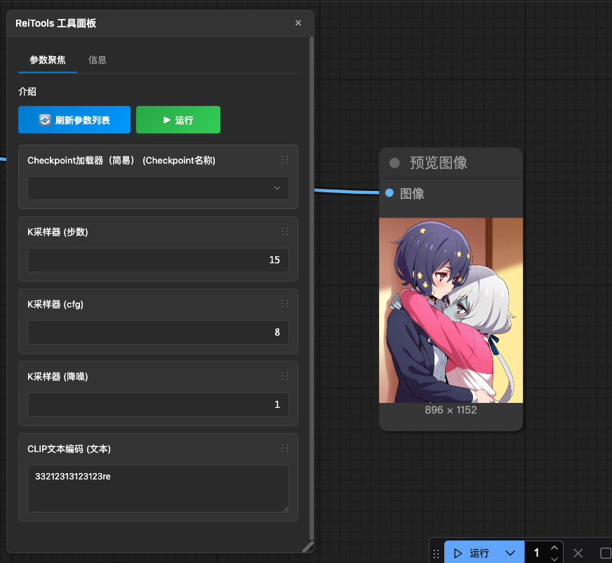
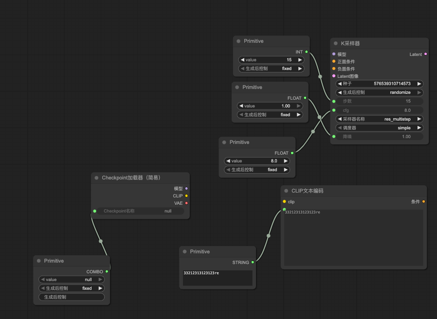
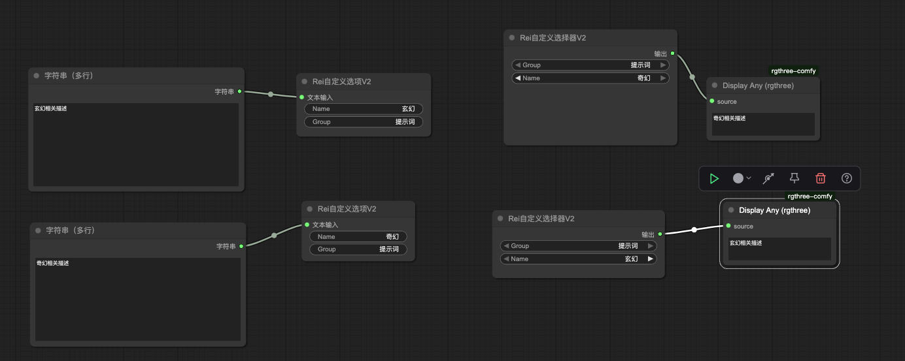
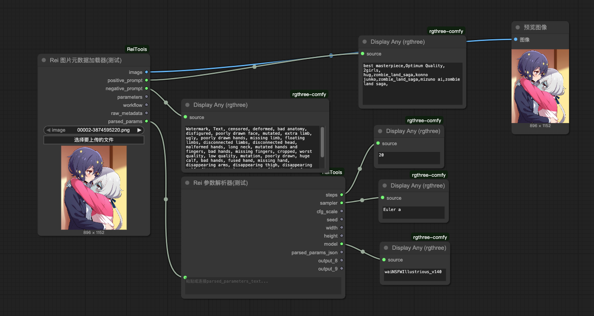

# ComfyUI-ReiTools

这是一个为 [ComfyUI](https://github.com/comfyanonymous/ComfyUI) 设计的自定义节点合集，包含一些方便工作流搭建的实用工具。

## 🆕 最近更新

<details open>
<summary><strong>v1.5.1 (最新)</strong></summary>

添加了一个浮动工具面板，可以点击右下角的"Rei Tools"按钮打开。

### 🎯 参数聚焦功能

类似 sdppp,只要将频繁需要调节的参数连接上一个 PrimitiveNode，
然后点击刷新参数列表，对应参数就会显示在面板里，然后只需要将视角关注在工作流的输出位置即可，
每次参数调节可以直接在浮动面板上面调节，不用来回拖动画布找节点。
PS：做了节点改动或者 PrimitiveNode 连接了其他的节点后什么的，都需要点击一下刷新参数按钮，目前不会自动刷新

### 📁 预设管理功能（测试版）

新增的预设管理功能，专为有大量模型或 Lora 文件，习惯按 SDXL、Flux 等子目录分别存放的用户设计。

#### 🎛️ 四项配置功能

- **📂 模型路径限制**：配置模型文件的搜索路径，支持多个目录
- **🎨 Lora 路径限制**：配置 Lora 文件的搜索路径，独立管理
- **🎯 模型加载节点类型**：指定哪些节点类型被视为模型加载节点（默认：CheckpointLoaderSimple, UNETLoader）
- **🎨 Lora 加载节点类型**：指定哪些节点类型被视为 Lora 加载节点（默认：LoraLoader）

#### 🔧 工作原理

**重要说明**：预设的限制目录功能仅仅是对参数聚焦中下拉框显示的列表进行一次过滤，**并不会改变节点读取的实际目录**。该功能也只会影响参数聚焦里面的下拉框选项。

#### 🛠️ 第三方节点支持

如果使用第三方加载节点，需要将对应节点类型添加到相应的"加载节点类型"配置中才能被正常识别和过滤。

#### 🎨 使用场景

该功能专为以下用户场景设计：

- 拥有大量模型或 Lora 文件
- 习惯按 SDXL、Flux、SD1.5 等类型分子目录存放
- 需要在不同工作流间快速切换关注的文件范围
- 可以保存多套预设（如"SDXL 专用"、"Flux 专用"），快速过滤掉不需要关心的模型和 Lora

#### 已知 bug

假如已经在参数聚焦里选择了一个模型，然后再预设里做了设置导致下拉框变动，这个模型不再显示在下拉框里，需要手动切换选择到其他任意一个可选的模型，然后才能触发 comfyui 本身刷新




</details>
<details >
<summary><strong>v1.4.2</strong></summary>

新增 v2 版本自定义下拉框组件，参考 kj 大佬写法，现在不用远距离连线了

</details>

<details>
<summary><strong>v1.4.1 - bug 修复</strong></summary>

- 自定义下拉框的节点的动态输入会导致该节点无法被复制，故暂时修改为固定最大 10 个 option

</details>

<details>
<summary><strong>v1.4.0 - 🖼️ 图片元数据处理</strong></summary>

- ✨ **新增图片元数据加载器（测试）**：`ReiImageMetadataLoader` 支持从 AI 生成图片中提取 prompt 和参数
- 🎯 **两种元数据格式支持**：普通 WebUI 格式、Civitai 元数据 格式
- 📊 **智能参数解析**：自动识别并结构化输出各种生成参数
- 🔍 **强大的兼容性**：支持 PNG、JPG、JPEG、WebP 等多种图片格式
- 🛠️ **专业解析工具**：`ReiMetadataParser` 节点专门处理 WebUI 格式参数文本
- 🎨 **逆向工程能力**：从现有 AI 图片中提取参数重现生成效果

</details>

<details>
<summary><strong>v1.3.0 - 🔐 加密存储与安全增强</strong></summary>

- ✨ **新增 Token 加密存储功能**：支持使用密码对敏感配置进行对称加密
- 🔑 **配置读取器密码支持**：读取加密配置时可输入密码自动解密
- 🎯 **智能权限控制**：加密配置需要正确密码才能编辑、复制和读取
- 💾 **配置存储升级**：从简单键值对升级为包含类型、加密状态、时间戳的对象格式
- 🛡️ **安全体验优化**：就近错误提示、自动滚动、密码错误拦截等
- 🔧 **Bug 修复**：修复类型显示错误、3KeyGroup 下拉列表等问题

</details>

<details>
<summary><strong>v1.2.0 - 📋 用户体验优化</strong></summary>

- 📋 **一键复制功能**：为每个配置项添加复制到剪贴板按钮
- 🎛️ **编辑体验改进**：编辑时禁用键名和类型修改，增加自动滚动
- ⚡ **实时验证增强**：改进输入验证和错误提示机制
- 🎨 **界面优化**：更好的视觉反馈和用户引导

</details>

<details>
<summary><strong>v1.1.0 - 🔗 三键组合功能</strong></summary>

- 🔗 **三键组合类型**：支持将最多三个配置键组合管理
- 📦 **批量加载节点**：`Rei3KeyGroupLoader` 节点一次性获取三个配置值
- 🎯 **智能选择器**：配置管理器中的键选择下拉框，支持重复检查

</details>

<details>
<summary><strong>v1.0.0 - 🚀 核心功能发布</strong></summary>

- ⚙️ **配置管理器**：可视化侧边栏配置管理界面
- 📝 **多类型支持**：字符串、整数、浮点数、布尔值、令牌/密钥
- 🔍 **配置读取器**：`ReiConfigLoader` 节点动态读取配置
- 📁 **文件选择器**：`ReiPromptFileSelector` 节点选择文本文件
- 🎛️ **自定义下拉框**：动态选项的下拉框组合节点

</details>

## 📖 目录

- [最近更新](#-最近更新)
- [安装指南](#-安装指南)
- [配置管理器](#-配置管理器)
  - [功能特性](#功能特性)
  - [Token 加密存储](#-token-加密存储)
  - [使用方法](#使用方法)
  - [数据类型支持](#数据类型支持)
  - [安全注意事项](#-安全注意事项)
- [工作流节点](#-工作流节点)
  - [Rei 配置读取器](#rei-配置读取器-reiconfigloader)
  - [Rei 三键组合加载器](#rei-三键组合加载器-rei3keygrouploader)
  - [Rei Prompt 文件选择器](#rei-prompt-文件选择器-reipromptfileselector)
  - [Rei 自定义下拉框组合](#rei-自定义下拉框组合)
    - [Rei 下拉框选项 V2 (ReiCustomSelectorOptionV2)](#rei-下拉框选项-v2-reicustomselectoroptionv2)
    - [Rei 自定义下拉框 V2 (ReiCustomSelectorV2)](#rei-自定义下拉框-v2-reicustomselectorv2)
    - [Rei 下拉框选项 (ReiSelectorOptionObject)](#rei-下拉框选项-reiselectoroptionobject)
    - [Rei 自定义下拉框 (ReiCustomSelector)](#rei-自定义下拉框-reicustomselector)
  - [Rei 图片元数据加载器 (ReiImageMetadataLoader)](#rei-图片元数据加载器-reiimageMetadataloader)
  - [Rei 元数据解析器 (ReiMetadataParser)](#rei-元数据解析器-reimetadataparser)
  - [Rei 文件夹选择器 (ReiFolderSelector)](#rei-文件夹选择器-reifolderselector)
  - [Rei 文件计数器 (ReiFileCounter)](#rei-文件计数器-reifilecounter)
- [📸 截图演示](#-截图演示)
  - [配置管理器界面](#配置管理器界面)
  - [Prompt 文件选择器](#prompt-文件选择器)
  - [自定义下拉框组合](#自定义下拉框组合-1)
- [🤝 贡献](#-贡献)
- [📄 许可证](#-许可证)

---

## 🚀 安装指南

1. 打开终端或命令行界面
2. 导航到 ComfyUI 安装目录下的 `custom_nodes` 文件夹：

   ```bash
   cd ComfyUI/custom_nodes/
   ```

3. 克隆本仓库：
   ```bash
   git clone https://github.com/x956606865/ComfyUI-ReiTools
   ```
4. **重启 ComfyUI**

---

## ⚙️ 配置管理器

<details>
<summary><strong>配置管理器功能介绍</strong></summary>

配置管理器是一个强大的侧边栏工具，用于管理环境配置变量。无需在工作流中添加节点，直接通过可视化界面进行配置管理。

### 功能特性

- 🎯 **可视化管理**：通过侧边栏界面轻松管理所有配置
- 🔄 **实时验证**：输入时立即验证数据类型和格式
- 🔒 **隐私保护**：敏感信息（Token/密钥）在列表中自动隐藏
- 🔐 **加密存储**：支持对敏感配置进行密码保护的加密存储
- 📝 **多类型支持**：字符串、整数、浮点数、布尔值、令牌/密钥、三键组合
- 📋 **一键复制**：每个配置项都有复制到剪贴板按钮
- ⚡ **即时生效**：配置保存后按 `R` 键刷新节点即可使用

### 🔐 Token 加密存储

为了保护 API 密钥等敏感信息，配置管理器提供了强大的加密存储功能：

#### 加密特性

- 🛡️ **AES-GCM 加密**：使用行业标准的对称加密算法
- 🔑 **PBKDF2 密钥派生**：从密码安全地派生加密密钥
- 🎲 **随机盐和 IV**：每次加密都使用不同的随机值
- 🔐 **前后端兼容**：前端加密的数据后端节点可以解密

#### 使用加密存储

1. **启用加密**

   - 在配置管理器顶部找到"🔐 Token 加密设置"区域
   - 勾选"启用 Token 加密存储"
   - 输入一个强密码（请牢记，丢失后无法恢复）

2. **保存加密配置**

   - 选择"令牌/密钥"类型
   - 输入敏感信息（如 API 密钥）
   - 保存时会自动使用密码加密

3. **识别加密配置**

   - 加密配置在列表中显示 🔐 图标
   - 普通 Token 显示 🔒 图标
   - 值在列表中始终显示为星号

4. **编辑/复制加密配置**
   - 必须先启用加密并输入正确密码
   - 密码错误时会显示明确的错误提示
   - 编辑时自动解密显示明文，保存时重新加密

#### 安全提示

> ⚠️ **重要**：加密密码无法恢复，请务必妥善保管！
>
> - 建议使用强密码（包含大小写字母、数字、特殊字符）
> - 密码丢失后，加密的配置将无法解密
> - 可以考虑使用密码管理器存储加密密码

### 使用方法

1. **打开配置管理器**

   - 在 ComfyUI 左侧侧边栏找到 📄 图标（文件编辑）
   - 点击打开配置管理器面板

2. **添加新配置**

   - 点击 "新增" 按钮
   - 填写配置项信息：
     - **键名**：配置项的名称（如：`openai_api_key`）
     - **类型**：选择合适的数据类型
     - **值**：配置项的值
   - 点击 "保存"

3. **编辑现有配置**

   - 在配置列表中点击对应项的 "编辑" 按钮
   - 修改后点击 "保存"

4. **删除配置**

   - 点击对应项的 "删除" 按钮
   - 确认删除操作

5. **使配置生效**
   - 修改配置后，按键盘 `R` 键刷新节点
   - 或重新加载工作流

### 数据类型支持

| 类型          | 说明         | 示例                      | 验证规则               | 特殊功能                            |
| ------------- | ------------ | ------------------------- | ---------------------- | ----------------------------------- |
| **字符串**    | 普通文本     | `"Hello World"`           | 任意文本               | -                                   |
| **整数**      | 整数数值     | `42`, `-123`              | 仅允许整数             | -                                   |
| **浮点数**    | 小数数值     | `3.14`, `-0.5`            | 数字格式验证           | -                                   |
| **布尔值**    | 真假值       | `true`, `false`, `1`, `0` | 支持多种格式           | -                                   |
| **令牌/密钥** | 敏感信息     | API 密钥、访问令牌        | 字符串格式             | 🔒 列表隐藏显示<br/>🔐 可选加密存储 |
| **三键组合**  | 批量配置管理 | 选择最多三个已有配置键    | 键存在性检查，无重复键 | 📦 专用加载器节点                   |

### 🔒 安全注意事项

> **⚠️ 重要警告**
>
> 配置文件包含敏感信息，请注意以下安全事项：
>
> - 📁 **文件位置**：`ComfyUI根目录/env_config.json`
> - 🚫 **禁止分享**：切勿将此文件分享给他人
> - 🔐 **敏感数据**：使用"令牌/密钥"类型存储 API 密钥等敏感信息
> - 🔑 **加密存储**：强烈建议对重要的 Token 启用加密存储功能
> - 🗝️ **密码管理**：妥善保管加密密码，丢失后无法恢复加密数据
> - 💾 **备份建议**：定期备份配置文件（移除敏感信息后）
> - 🛡️ **权限控制**：加密配置需要正确密码才能访问

#### 加密安全等级

| 安全等级 | 存储方式    | 适用场景        | 安全性      |
| -------- | ----------- | --------------- | ----------- |
| 🔓 低    | 明文存储    | 非敏感配置      | ⚠️ 文件可读 |
| 🔒 中    | Token 类型  | 一般敏感信息    | 🔒 列表隐藏 |
| 🔐 高    | 加密 + 密码 | 重要 API 密钥等 | 🛡️ 密码保护 |

</details>

---

## 🧩 工作流节点

所有节点都可以在 `Rei Tools` 分类下找到。

### 📱 参数聚焦面板

<details>
<summary><strong>查看详细介绍和使用方法</strong></summary>

浮动工具面板，通过点击右下角的"Rei Tools"按钮打开。提供参数聚焦功能，让您可以在固定位置调节工作流中的关键参数。

#### 功能特点

- **集中管理**：将频繁调节的参数集中到一个浮动面板中
- **拖拽排序**：支持拖拽调整参数的显示顺序
- **响应式布局**：面板宽度超过阈值时自动切换为两列布局
- **多种输入类型**：支持文本、数字、下拉选择等多种参数类型

#### 使用方法

1. **连接参数**：将需要频繁调节的参数连接到 `PrimitiveNode`
2. **打开面板**：点击右下角的"Rei Tools"按钮打开浮动面板
3. **刷新列表**：在面板中点击"刷新参数列表"按钮加载参数
4. **调节参数**：直接在面板中修改参数值，无需在画布中寻找节点

#### 适用场景

- **参数调优**：在输出位置观察结果的同时调节参数
- **批量测试**：快速切换不同的参数组合进行测试
- **工作流演示**：保持画布整洁，专注于结果展示

#### 注意事项

- 节点改动或 PrimitiveNode 连接变化后需要手动刷新参数列表
- 目前不支持自动检测参数变化，需要主动刷新


</details>

### Rei 配置读取器 (`ReiConfigLoader`)

<details>
<summary><strong>查看详细介绍和使用方法</strong></summary>

从环境配置文件中读取指定的配置值，支持加密配置的自动解密。

- **输入**：

  - `config_key` (`下拉选择`): 要读取的配置项名称
  - `password (可选)` (`STRING`, 可选): 解密加密配置时需要的密码

- **输出**：
  - `value` (`STRING`): 配置项的值（字符串格式）

**使用场景**：在工作流中动态获取 API 密钥、模型路径等配置信息。如果需要其他类型，可以使用类型转换节点。

**加密支持**：

- 🔓 **普通配置**：直接读取，无需密码
- 🔐 **加密配置**：需要输入密码，自动解密后返回明文
- ⚠️ **错误处理**：密码错误或未提供时返回明确的错误信息


**使用示例**：如图所示，通过配置读取器获取 `glm_v4_token` 的值，并将其传递给需要 API 密钥的节点。

</details>

### Rei 三键组合加载器 (`Rei3KeyGroupLoader`)

<details>
<summary><strong>查看详细介绍和使用方法</strong></summary>

从 3KeyGroup 类型的配置中批量加载三个键对应的值，支持组合中包含加密配置的解密。

- **输入**：

  - `group_key` (`下拉选择`): 从下拉列表选择的 3KeyGroup 配置项
  - `password (可选)` (`STRING`, 可选): 解密组合中加密配置时需要的密码

- **输出**：
  - `value1` (`STRING`): 第一个键对应的值（字符串格式）
  - `value2` (`STRING`): 第二个键对应的值（字符串格式）
  - `value3` (`STRING`): 第三个键对应的值（字符串格式）

**使用场景**：当需要同时使用多个相关配置时，可以将它们组合成一个 3KeyGroup，然后通过这个节点一次性获取所有值。如果需要其他类型，可以使用类型转换节点。

**加密支持**：

- 🔓 **普通组合**：直接读取所有配置，无需密码
- 🔐 **混合组合**：组合中有加密配置时需要输入密码
- 🎯 **独立解密**：每个键的加密状态独立处理
- ⚠️ **错误处理**：明确指示哪个键需要密码或解密失败

**配置步骤**：

1. 在配置管理器中选择"三键组合"类型
2. 从下拉框中选择要组合的配置键（最多 3 个）
3. 保存配置后，该节点的下拉列表会显示新创建的组合
4. 选择组合后，节点会输出三个对应的配置值


**使用示例**：如图所示，创建了名为 `glm配置组合` 的三键组合，将三个配置值批量传递给 GLM4 对话节点，实现了便捷的批量配置管理。

</details>

### Rei Prompt 文件选择器 (`ReiPromptFileSelector`)

<details>
<summary><strong>查看详细介绍和使用方法</strong></summary>

从指定文件夹中选择并加载文本文件内容。

- **工作原理**：

  - 自动扫描 `ComfyUI/prompts/` 目录
  - 目录不存在时自动创建
  - 支持 `.txt` 文件的选择和加载

- **输入**：

  - `filename` (`STRING`): 从下拉列表选择的文件名

- **输出**：
  - `text` (`STRING`): 文件的文本内容

</details>

### Rei 自定义下拉框组合

<details>
<summary><strong>查看详细介绍和使用方法</strong></summary>

由两个协作节点组成的动态下拉选择系统：

#### Rei 下拉框选项 V2 (`ReiCustomSelectorOptionV2`)

定义下拉框选项的名称和值以及 group。

- **输入**：

  - `name` (`STRING`): 选项显示名称
  - `value` (`STRING`): 选项对应的值

- **输出**：
  - `rei_selector_option_object`: 选项对象

#### Rei 自定义下拉框 V2 (`ReiCustomSelectorV2`)

生成动态下拉选择框



- **输入**：

  - `Group`: 在自定义选项里设置的分组
  - `Name`: 动态生成的下拉选择框

- **输出**：
  - `value` (`STRING`): 选中选项的对应值

#### Rei 下拉框选项 (`ReiSelectorOptionObject`)

定义下拉框选项的名称和值。

- **输入**：

  - `group` (`STRING`): 给选项设置一个分组
  - `name` (`STRING`): 选项显示名称
  - `文本输入` (`STRING`): 选项对应的值

- **输出**：
  - 无

#### Rei 自定义下拉框 (`ReiCustomSelector`)

接收多个选项，生成动态下拉选择框。

- **输入**：

  - `option_1` ~ `option_20`: 最多 20 个选项对象
  - `selected_option`: 动态生成的下拉选择框

- **输出**：
  - `value` (`STRING`): 选中选项的对应值

**使用示例**：

1. 创建多个"Rei 下拉框选项"节点，分别设置不同的名称和值
2. 将这些选项连接到"Rei 自定义下拉框"节点
3. 在下拉框中选择需要的选项
4. 获取对应的输出值用于后续处理

</details>

---

### Rei 图片元数据加载器 (ReiImageMetadataLoader)

<details>
<summary><strong>查看详细介绍和使用方法</strong></summary>

一个强大的图片元数据提取节点，支持从 AI 生成的图片中提取 prompt、参数和 workflow 信息。



**备注**
该功能具有很强的不确定性，因为很多网站或者生成工具会删除生成图片时的附带元数据，无法读取。不同的生图工具，附带的格式也具有一定的差异。目前我测试了的只有原生 webui 生成的图片、c 站下载的 comfyui 图片和 webui 图片，只要没有被删掉元数据，基本能正常读取

**Todo**
对于 C 站的图片，元数据里还附带了模型信息以及 lora 信息，考虑全部提取出来，可以自动跳转 c 站或者自动下载（未做）

**功能特性**：

- 🖼️ **多格式支持**：支持 PNG、JPG、JPEG、WebP 格式图片
- 🎯 **四种元数据格式**：
  - 普通 WebUI PNG 参数格式
  - 普通 ComfyUI PNG workflow 格式
  - Civitai ComfyUI JSON 格式（从 EXIF/UserComment 提取）
  - Civitai WebUI UNICODE 格式（从 EXIF 提取）
- 🔍 **智能检测**：自动识别图片中的元数据类型和格式
- 📊 **结构化输出**：将提取的参数转换为结构化的 JSON 对象

**输入**：

- `image`: 图片文件选择器

**输出**：

- `image` (`IMAGE`): 加载的图片张量
- `positive_prompt` (`STRING`): 正向提示词
- `negative_prompt` (`STRING`): 负向提示词
- `parameters` (`STRING`): 原始参数文本
- `workflow` (`STRING`): 工作流 JSON（如果存在）
- `raw_metadata` (`STRING`): 原始元数据信息
- `parsed_params` (`STRING`): 解析后的结构化参数 JSON

**使用场景**：

1. **逆向工程 AI 图片**：从现有 AI 生成图片中提取参数重现效果
2. **工作流分析**：分析和学习其他人的 ComfyUI 工作流
3. **批量处理**：提取大量图片的生成参数进行分析
4. **参数复用**：将提取的参数应用到新的生成任务中

</details>

---

### Rei 元数据解析器 (ReiMetadataParser)

<details>
<summary><strong>查看详细介绍和使用方法</strong></summary>

专门用于解析 WebUI 格式参数文本的节点，将参数字符串转换为结构化的参数对象。

**功能特性**：

- 📝 **WebUI 参数解析**：支持解析标准的 WebUI 参数格式
- 🔧 **智能参数提取**：自动识别和提取各种生成参数
- 📊 **结构化输出**：输出标准的 JSON 格式参数对象
- 🛠️ **错误处理**：对无效或不完整的参数进行容错处理

**输入**：

- `parameters_text` (`STRING`): WebUI 格式的参数文本

**输出**：

- `parsed_params` (`STRING`): 解析后的结构化参数 JSON
- `positive_prompt` (`STRING`): 提取的正向提示词
- `negative_prompt` (`STRING`): 提取的负向提示词

**支持的参数**：

- 基本参数：`steps`、`cfg_scale`、`seed`、`width`、`height`
- 采样器：`sampler`、`scheduler`
- 模型信息：`model`、`vae`
- 高级参数：`denoising_strength`、`clip_skip` 等

**使用场景**：

1. **参数标准化**：将文本格式的参数转换为 JSON 结构
2. **工作流集成**：将解析的参数用于自动化工作流
3. **批量分析**：处理大量 WebUI 格式的参数文本
4. **参数验证**：检查和验证参数的完整性

</details>

---

### Rei 文件夹选择器 (ReiFolderSelector)

<details>
<summary><strong>查看详细介绍和使用方法</strong></summary>

一个简单易用的文件夹选择器节点，通过点击按钮弹出文件夹选择器，选择后返回文件夹的绝对路径。适合用于 comfyui 服务和本机不是同一台机器的情况，可以直接选取到宿主机的文件夹

**输入**：

- `folder_path` (`STRING`): 显示选中的文件夹路径（只读）
- `initial_directory` (`STRING`, 可选): 文件选择器的起始目录路径

**输出**：

- `folder_path` (`STRING`): 选中文件夹的绝对路径

**使用方法**：

1. **添加节点**：在 ComfyUI 中添加"Rei 文件夹选择器"节点
2. **设置起始目录**（可选）：在 `initial_directory` 输入框中指定文件选择器的起始目录路径
3. **点击按钮**：点击节点上的"📁 选择文件夹"按钮
4. **浏览选择**：在弹出的文件夹选择器中浏览并选择目标文件夹
   - 点击文件夹名称选中
   - 双击文件夹进入子目录
   - 点击"⬆️ 返回上级目录"返回上一级
5. **确认选择**：点击"确认选择"按钮完成选择
6. **获取路径**：节点输出选中文件夹的绝对路径

</details>

---

### Rei 文件计数器 (ReiFileCounter)

<details>
<summary><strong>查看详细介绍和使用方法</strong></summary>

一个智能的文件统计节点，可以统计指定目录下特定后缀的文件数量，并动态生成文件后缀下拉框选项。

**输入**：

- `directory_path` (`STRING`): 要统计的目录路径（只读，通过按钮选择）
- `file_extension` (`STRING`): 文件后缀（动态下拉框，自动生成选项）
- `initial_directory` (`STRING`, 可选): 文件选择器的起始目录路径

**输出**：

- `file_count` (`INT`): 匹配的文件数量
- `available_extensions` (`STRING`): 可用文件后缀列表（JSON 格式）
- `selected_files` (`STRING`): 匹配的文件路径列表（JSON 格式）

**使用方法**：

1. **添加节点**：在 ComfyUI 中添加"Rei 文件计数器"节点
2. **设置起始目录**（可选）：在 `initial_directory` 输入框中指定文件选择器的起始目录路径
3. **选择目录**：点击"📁 选择目录"按钮，选择要统计的目录
4. **选择后缀**：从自动生成的下拉框中选择要统计的文件后缀
5. **查看结果**：节点输出该后缀的文件数量和详细信息
6. **刷新列表**：如果目录内容有变化，点击"🔄 刷新后缀列表"按钮

**使用场景**：

1. **模型统计**：统计模型目录中各种格式的模型文件数量
2. **数据集分析**：分析数据集中不同格式文件的数量分布
3. **工作流验证**：检查工作流输出目录中生成的文件数量
4. **磁盘清理**：统计特定类型文件占用空间的情况

**技术特点**：

- 🔍 **递归搜索**：自动搜索子目录中的所有文件
- 📈 **智能排序**：后缀列表按文件数量从多到少排序
- 🛡️ **错误处理**：完善的路径验证和错误提示机制
- ⚡ **性能优化**：高效的目录扫描和文件统计算法

</details>

---

## 📸 截图演示

<details>
<summary><strong>查看界面截图和演示</strong></summary>

### 配置管理器界面

配置管理器提供直观的可视化配置管理体验，界面包含重要提醒、配置列表和操作按钮。


**界面说明：**

- 🟠 **重要提醒**：修改配置后需按 "R" 键刷新节点
- 🔴 **安全警告**：提醒用户保护配置文件安全
- 📋 **配置列表**：显示所有配置项，Token 类型自动隐藏敏感信息
- 🔒 **隐私保护**：敏感配置显示为星号，并标注锁图标

### Prompt 文件选择器


### 自定义下拉框组合


</details>

---

## 🤝 贡献

欢迎提交 Issue 和 Pull Request 来改进这个项目！

## 📄 许可证

本项目基于 MIT 许可证开源。

---

希望这些工具能对你的 ComfyUI 工作流有所帮助！ 🎉

```

```
