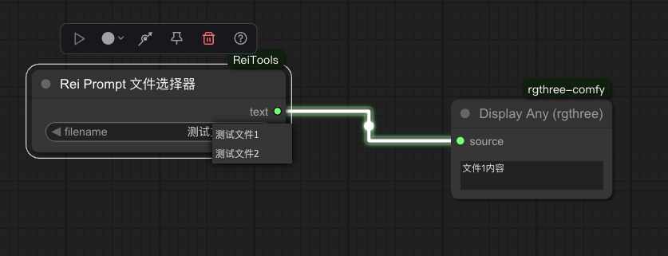

# ComfyUI-ReiTools

这是一个为 [ComfyUI](https://github.com/comfyanonymous/ComfyUI) 设计的自定义节点合集，包含一些方便工作流搭建的实用工具。

## 安装

1. 打开终端或命令行界面。
2. `cd` 到你的 ComfyUI 安装目录下的 `custom_nodes` 文件夹。
   ```bash
   cd ComfyUI/custom_nodes/
   ```
3. 克隆本仓库：

   ```bash
   git clone https://github.com/x956606865/ComfyUI-ReiTools
   ```

4. 重启 ComfyUI。

## 节点介绍

所有节点都可以在 `Rei Tools` 分类下找到。

---

### Rei Prompt 文件选择器 (`ReiPromptFileSelector`)

这个节点可以让你从一个特定的文件夹 (`ComfyUI/prompts/`) 中选择一个 `.txt` 文件，并将其内容作为文本输出。这对于管理和复用复杂的 Prompt 非常有用。

- **工作原理**:

  - 节点会自动扫描 `ComfyUI/prompts/` 目录。如果该目录不存在，它会自动创建。
  - 目录下的所有 `.txt` 文件（不含扩展名）会作为一个下拉列表显示在节点上。
  - 当你选择一个文件时，它的全部内容会被读取并输出。

- **输入**:

  - `filename` (`STRING`): 从下拉列表中选择的文件名。

- **输出**:
  - `text` (`STRING`): 所选 `.txt` 文件的文本内容。



---

### Rei 下拉框选项 (`ReiSelectorOptionObject`) & Rei 自定义下拉框 (`ReiCustomSelector`)

这两个节点需要配合使用，来创建一个动态的、可自定义选项的下拉选择框。你可以预设多组名值对（例如，不同的风格提示词、不同的模型配置参数等），然后在工作流中通过一个下拉框方便地切换。

#### 1. Rei 下拉框选项 (`ReiSelectorOptionObject`)

这个节点用于定义一个下拉框中的“选项”。每个选项都包含一个**名称**和一个**值**。

- **输入**:

  - `name` (`STRING`): 选项在下拉列表中显示的名称。
  - `value` (`STRING`): 当该选项被选中时，实际输出的值（可以是较长的文本，如一段完整的 Prompt）。

- **输出**:
  - `rei_selector_option_object` (`REI_SELECTOR_OPTION_OBJECT`): 一个包含名称和值的选项对象，用于连接到`Rei 自定义下拉框`节点。

#### 2. Rei 自定义下拉框 (`ReiCustomSelector`)

这个节点接收一个或多个`Rei 下拉框选项`节点的输出，生成一个下拉选择框，并根据用户的选择输出对应的值。

- **输入**:

  - `option_1` (可选, `REI_SELECTOR_OPTION_OBJECT`): 连接一个`Rei 下拉框选项`节点。
  - `option_2` (可选, `REI_SELECTOR_OPTION_OBJECT`): 连接另一个`Rei 下拉框选项`节点。
  - ... (最多支持 20 个选项输入)
  - `selected_option` (`STRING`): 节点上动态生成的下拉框，显示所有连接选项的`name`。

- **输出**:
  - `value` (`STRING`): 根据`selected_option`的选择，输出其对应的`value`。

#### 使用示例

假设你想在“科幻风格”和“奇幻风格”两种 Prompt 之间切换：

1. 创建两个 `Rei 下拉框选项` 节点。
   - **节点 A**: `name` 设置为 "科幻"，`value` 设置为 "未来的城市，飞行汽车，机器人..."
   - **节点 B**: `name` 设置为 "奇幻"，`value` 设置为 "魔法森林，精灵，巨龙..."
2. 创建一个 `Rei 自定义下拉框` 节点。
3. 将**节点 A**的输出连接到`自定义下拉框`的 `option_1` 输入。
4. 将**节点 B**的输出连接到`自定义下拉框`的 `option_2` 输入。
5. 现在，`自定义下拉框`节点上会出现一个下拉菜单，包含 "科幻" 和 "奇幻" 两个选项。
6. 当你选择 "科幻" 时，该节点会输出 "未来的城市，飞行汽车，机器人..."。你可以将这个输出连接到你的 Prompt 输入框中。


---

希望这些工具能对你有所帮助！
